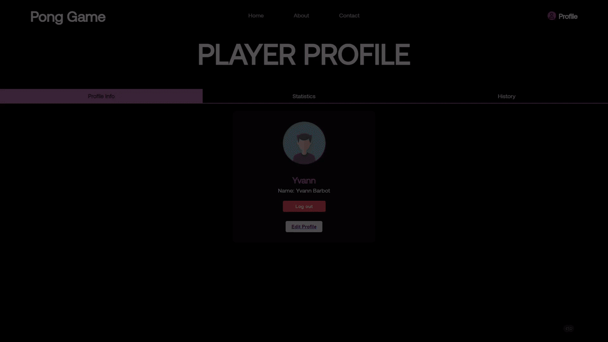
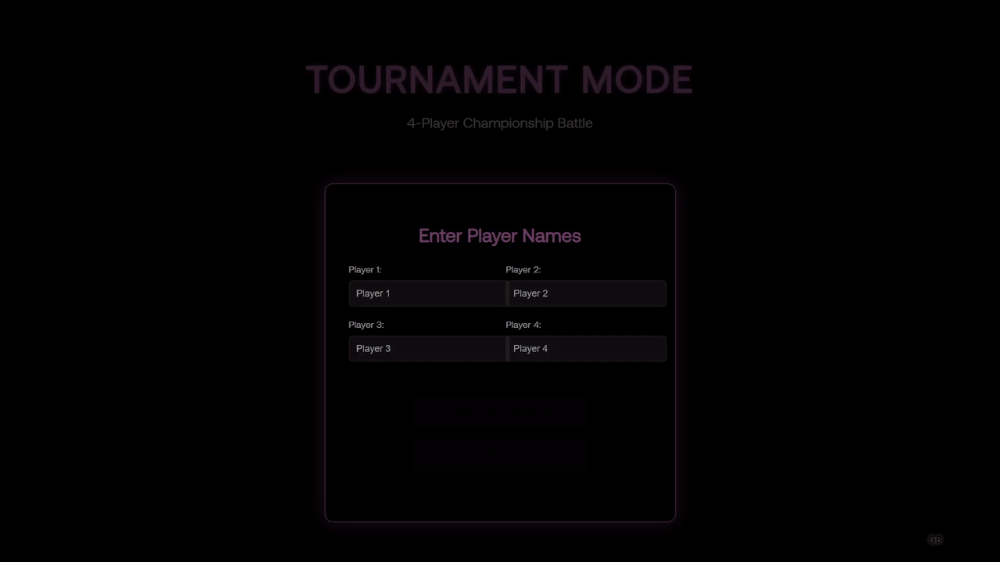
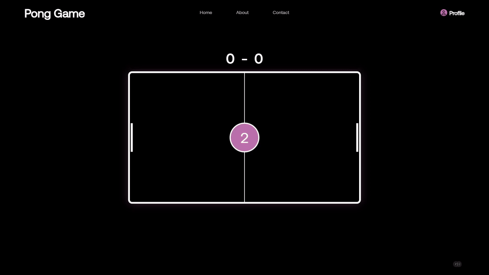

# ft_transcendence — Multiplayer Pong Reinvented 🕹️

[](https://www.docker.com/)
[](https://42.fr)
[]()
[](https://opensource.org/licenses/MIT)

> A full-stack multiplayer web app containerized with Docker and served via Nginx, featuring a TypeScript frontend and a Fastify (Node.js) backend with OAuth and JWT-based authentication. Built by 42 School students to showcase real-time gameplay, secure web architecture, and modular deployment.

---

## 🎥 Full Site Walkthrough

<p align="center">
  <video src="[put full walkthrough video here]" width="100%" controls autoplay loop muted></video>
</p>

A complete UI walkthrough of the platform — from home screen to game selection, user login, settings, and navigation.

---

## 🎞️ Feature Demos (GIF Grid)

|  |  |
|:--:|:--:|
|  |  |
|  |  |


---

## How to Run It ⚙️

Yes, you can run it on **Linux, macOS, or Windows** — no setup headaches.

```bash
# Clone the repo
git clone https://github.com/your-org/ft_transcendence.git
cd ft_transcendence

# Run everything with Docker
make

# Access in your browser
https://localhost:8443
```

That’s it. One command. Zero config. Ready to play.

---

## How It Works 🧠

[put diagram here]  

Under the hood:
- **Frontend**: TypeScript, TailwindCSS, i18n
- **Backend**: Fastify (Node.js), Google OAuth, JWT
- **Database**: SQLite for persistence
- **Dockerized** with Nginx and HTTPS for clean deploys

Security and privacy are deeply integrated:
- JWT-protected routes & sessions
- HTTPS for all connections
- Robust validation on both frontend & backend
- XSS and SQL injection prevention
- Secrets & tokens stored securely in `.env` (and ignored by Git)

> In short: fast, portable, safe.

---

## Core Features ✨

- 🕹️ Real-time WebSocket gameplay  
- 🔐 Google & local auth (JWT-secured)  
- 🎨 Customizable games (colors, rules, difficulty)  
- 🌍 Fully localized in English, French, and Spanish  
- 📊 Player dashboards: W/L stats, match history  
- 🧑‍💼 GDPR tools: data download, anonymization, deletion  

All this in a responsive SPA that works across browsers and devices.

---

## About the Project 🧩

[put image here if needed]  

**ft_transcendence** is more than just Pong — it’s an experiment in full-stack architecture, real-time systems, UI/UX polish, and privacy-by-design. Everything from game mechanics to OAuth, from animations to Docker, was crafted by us.

---

## Meet the Team 👥

Each member of the squad brought their own power-ups:

| Name | Role | Highlights |
|------|------|-----------|
| **Yvann Barbot** | Game Dev | AI Opponent, Tournament Logic |
| **Romain Guignard** | Fullstack | Fastify Backend, GDPR, UX Polish |
| **Thomas Soloherison** | Backend Auth | JWT, Google OAuth, Stats Dashboards |
| **Lilien Auger** | Realtime Engineer | WebSocket Integration, Multi-language UI |
| **Luke Slater** | Frontend | UI/UX Design, Mobile Support, i18n Setup |

➡️ Learn more on our [Contact Page](/contact) and [About Page](/about).

---
